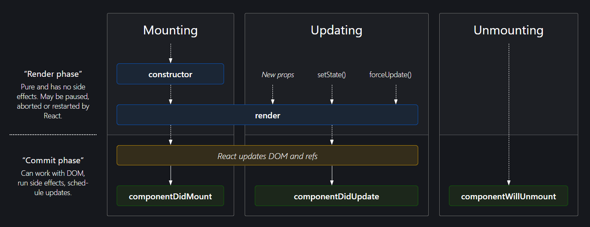

## Introduction

In React, class components have a lifecycle consisting of several phases, each with its own methods that you can override to execute code at specific points in the component's life. Here's an overview of the lifecycle methods in a React class component:

### Mounting Phase

- **constructor()** Initializes the component, setting up its initial state and binding methods.
- **render()** Renders the component's UI based on its current state and props.
- **componentDidMount()** Runs after the component is rendered for the first time. It's used for tasks like fetching external data or setting up event listeners.

### Updating Phase

- **static getDerivedStateFromProps()** Called when the component is about to re-render due to changes in props or state. It returns an object to update the state or null.
- **shouldComponentUpdate()** Determines if the component should re-render or not based on changes in props or state.
- **render()** Re-renders the component's UI with updated data.
- **getSnapshotBeforeUpdate()** Captures information from the DOM before it changes (e.g., scroll position).
- **componentDidUpdate()** Runs after the component is re-rendered due to updates in props or state. It's used for tasks like updating the DOM based on the new data.

### Unmounting Phase

- **componentWillUnmount()** Runs right before the component is removed from the DOM. It's used for cleanup tasks like removing event listeners or cancelling subscriptions.

### Error Handling Phase (Introduced in React 16)

- **static getDerivedStateFromError()** Called when a child component throws an error. It's used to render a fallback UI.
- **componentDidCatch()** Catches errors that occur during rendering in child components. It's used for logging errors and displaying an error message to the user.

## Wrapping It Up

These lifecycle methods provide hooks for executing code at specific points in a component's lifecycle, enabling developers to control behavior such as initialization, rendering, updating, and cleanup. However, with the introduction of React Hooks, functional components now offer an alternative way to manage component lifecycle and state.
